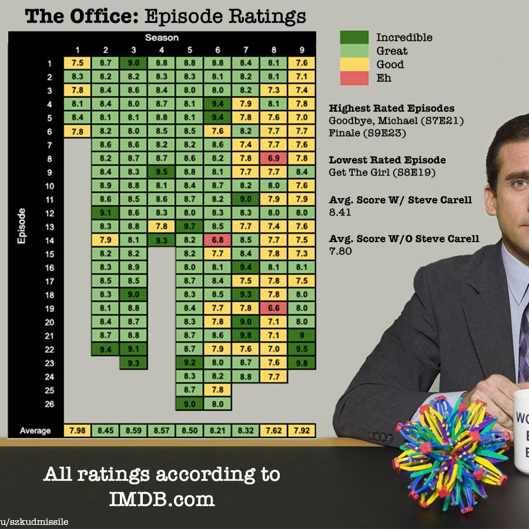

# GraphRatings
Scraping the ratings of a given show (from the user) and graphing the ratings by season and episode

For example

## Todo
- [x] Find a way to get the ratings of one show
- [x] Find a way to get all the episodes of one show by season
- [x] Create scraper that grabs all the ratings from a certain show
- [x] Implement a searching function that lets the user choose a specific show from the first 15 results
- [x] Create a program to graph all the ratings
- [x] Make images of all the ratings with corresponding colored backgrounds (make them small images, maybe 100 by 45)
- [x] Graph all the ratings but with images corresponding to the ratings
- [x] Collect user input
- [x] Implement a way to use the user input with the scraper
- [x] Put everything together in a main.py
- [ ] Add the icon that was saved into the figure
- [ ] Test for issues and fix accordingly
  - [x] Deal with image scaling
  - [ ] Cover issues regarding padding of axis
  - [ ] Find a way to make proper axis labels (exact ones)
- [ ] Make proper README

## UPDATES
**2:52am April 8th**: Complete most of it. Just need to deal with more issue fixing and improving the formatting of the graphs
                      There is a lot more to this project that still needs to be completed though
