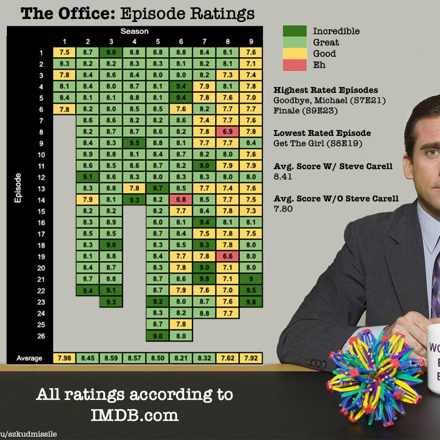

# GraphRatings
Scraping the ratings of a given show (from the user) and graphing the ratings by season and episode

For example

## Todo
- [ ] Create scraper that grabs all the ratings from a certain show
- [ ] Create a program to graph all the ratings
- [ ] Make images of all the ratings with corresponding colored backgrounds (make them small images, maybe 100 by 45)
- [ ] Graph all the ratings but with images corresponding to the ratings
- [ ] Collect user input
- [ ] Implement a way to use the user input with the scraper
- [ ] Put everything together in a main.py
- [ ] Test for issues and fix accordingly
- [ ] Make proper README
